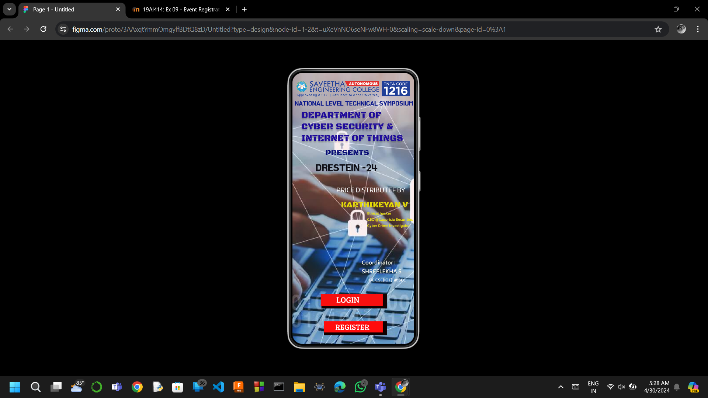
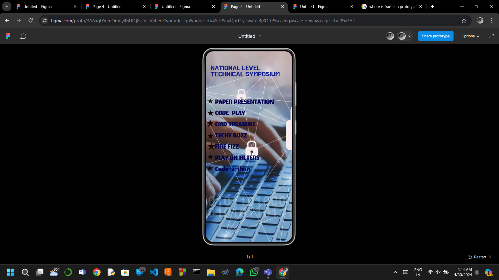
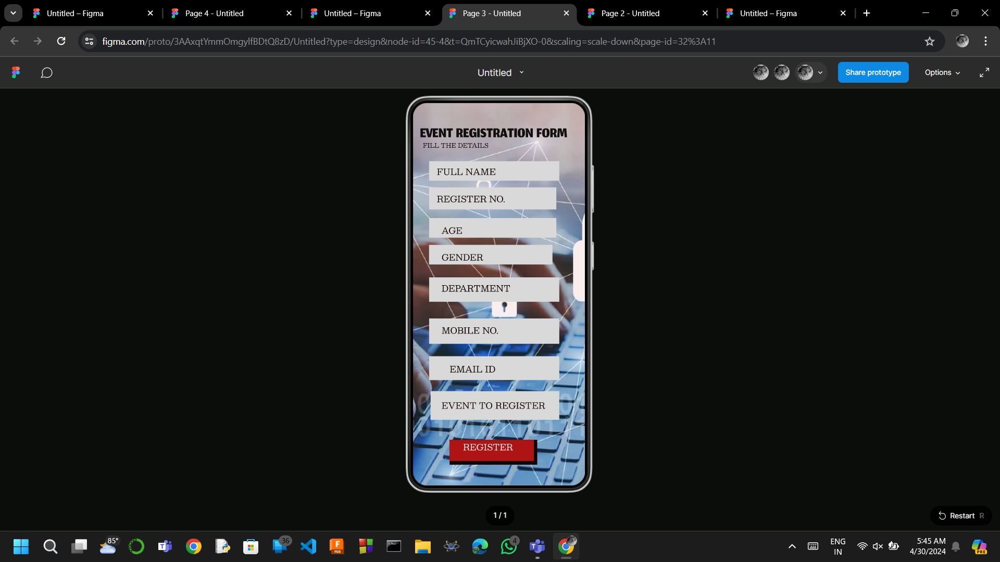
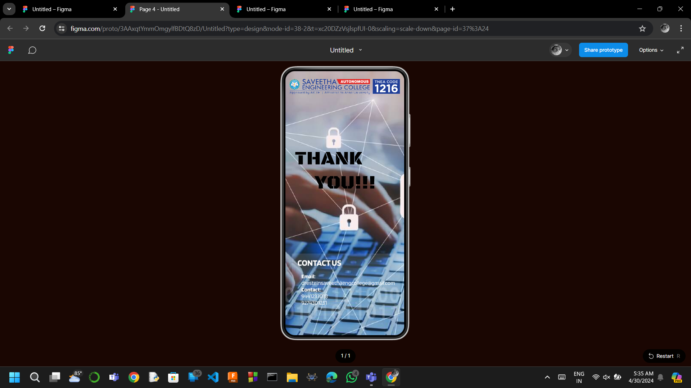

# Ex09 Event Registration Web Application
## Date:24.04.2024

## AIM:
To design, develop and deploy a web application for event registration.

## DESIGN STEPS:

### Step 1:
Create a new frame.

### Step 2:
Select any one preset size of your choice.

### Step 3:
Select the shapes you need.

### Step 4:
Import images as needed.

### Step 5:
Create pages based on your need and link them.

### Step 6:

Validate the HTML and CSS code.

### Step 6:

Publish the website in the given URL.

## DESIGN TOOL:
Figma

## PROGRAM:

```
1st page

<div className="AndroidLarge1" style={{width: 360, height: 800, position: 'relative', background: 'white'}}>
  
  
  <div className="DepartmentOfCyberSecurityInternetOfThings" style={{width: 327, height: 121, left: 27, top: 108, position: 'absolute', color: '#1F0B9A', fontSize: 27, fontFamily: 'Black Ops One', fontWeight: '400', wordWrap: 'break-word'}}>DEPARTMENT OF <br/>CYBER SECURITY & INTERNET OF THINGS</div>
  <div className="Presents" style={{width: 181, height: 29, left: 98, top: 222, position: 'absolute', color: '#0A0E76', fontSize: 23, fontFamily: 'Black Ops One', fontWeight: '400', wordWrap: 'break-word'}}>PRESENTS</div>
  <div className="Drestein24" style={{width: 258, height: 103, left: 69, top: 267, position: 'absolute', color: '#0F0F17', fontSize: 28, fontFamily: 'BM HANNA_TTF', fontWeight: '400', wordWrap: 'break-word'}}>DRESTEIN -24</div>
  <div className="CoordinatorShreelekhaS" style={{width: 165, height: 11, left: 205, top: 550, position: 'absolute', color: '#F4F5EC', fontSize: 15, fontFamily: 'Biryani', fontWeight: '700', wordWrap: 'break-word'}}>Coordinator :<br/>SHREELEKHA S</div>
  <div className="KarthikeyanV" style={{width: 203, height: 104, left: 144, top: 345, position: 'absolute', color: '#E3DA07', fontSize: 24, fontFamily: 'Black Ops One', fontWeight: '400', wordWrap: 'break-word'}}><br/>KARTHIKEYAN V<br/></div>
  <div className="BeCseIotAtSec" style={{width: 127, height: 30, left: 227, top: 604, position: 'absolute', color: 'white', fontSize: 11, fontFamily: 'Biryani', fontWeight: '700', wordWrap: 'break-word'}}>BE.CSE(IOT)  at SEC<br/></div>
  <div className="PriceDistributefBy" style={{width: 242, height: 38, left: 130, top: 332, position: 'absolute', color: 'white', fontSize: 22, fontFamily: 'Blinker', fontWeight: '400', wordWrap: 'break-word'}}>PRICE DISTRIBUTEF BY</div>
  <div className="EthicalHackerCeoCappricioSecuritiesCyberCrimeInvestigator" style={{width: 168, height: 333, left: 221, top: 408, position: 'absolute', color: '#EFE610', fontSize: 10, fontFamily: 'Biryani', fontWeight: '700', wordWrap: 'break-word'}}>Ethical hacker<br/>CEO @Cappricio Securities<br/>Cyber Crime Investigator</div>
  <div className="NationalLevelTechnicalSymposium" style={{width: 398, height: 573, left: 7, top: 82, position: 'absolute', color: '#0B188B', fontSize: 18, fontFamily: 'BM HANNA_TTF', fontWeight: '400', wordWrap: 'break-word'}}>NATIONAL LEVEL TECHNICAL SYMPOSIUM</div>
  <div className="Rectangle3" style={{width: 193, height: 43, left: 86, top: 653, position: 'absolute', background: '#140101'}} />
  <div className="Rectangle4" style={{width: 183, height: 36, left: 84, top: 653, position: 'absolute', background: '#F81010'}} />
  <div className="Login" style={{width: 97, height: 27, left: 130, top: 653, position: 'absolute', color: 'white', fontSize: 24, fontFamily: 'Bree Serif', fontWeight: '400', wordWrap: 'break-word'}}>LOGIN</div>
  <div className="Rectangle5" style={{width: 186, height: 41, left: 93, top: 734, position: 'absolute', background: '#0F0000'}} />
  <div className="Rectangle6" style={{width: 174, height: 33, left: 93, top: 734, position: 'absolute', background: '#FF0C0C'}} />
  <div className="Register" style={{width: 119, height: 33, left: 127, top: 734, position: 'absolute', color: 'white', fontSize: 23, fontFamily: 'Bree Serif', fontWeight: '400', wordWrap: 'break-word'}}>REGISTER</div>
</div>


```

```
2nd page

<div className="Frame1" style={{width: 360, height: 800, position: 'relative', background: 'white'}}>
  
  <div className="NationalLevelTechnicalSymposium" style={{width: 305, height: 59, left: 19, top: 57, position: 'absolute', color: '#0B188B', fontSize: 26, fontFamily: 'BM HANNA_TTF', fontWeight: '400', wordWrap: 'break-word'}}>NATIONAL LEVEL TECHNICAL SYMPOSIUM</div>
  <div className="PaperPresentationCodePlayCmdTreasureTechyBuzzFireFizzPlayOnFiltersCodeAThon" style={{width: 298, height: 357, left: 38, top: 192, position: 'absolute', color: '#04034F', fontSize: 47, fontFamily: 'Jomhuria', fontWeight: '400', wordWrap: 'break-word'}}>PAPER PRESENTATION<br/>CODE  PLAY<br/>CMD TREASURE<br/>TECHY BUZZ<br/>FIRE FIZZ<br/>PLAY ON FILTERS<br/>Code-a-thon</div>
</div>
```
```
3rd page

<div className="Full" style={{width: 281, height: 34, color: '#130D0D', fontSize: 13, fontFamily: 'Besley', fontWeight: '400', wordWrap: 'break-word'}}>Full</div>
<div className="Frame1" style={{width: 360, height: 800, position: 'relative', background: 'white'}}>
  
  <div className="EventRegistrationForm" style={{width: 345, height: 50, left: 15, top: 43, position: 'absolute', color: '#120F0F', fontSize: 47, fontFamily: 'Jomhuria', fontWeight: '400', wordWrap: 'break-word'}}>EVENT REGISTRATION FORM</div>
  <div className="FillTheDetails" style={{width: 325, height: 198, left: 21, top: 78, position: 'absolute', color: '#130505', fontSize: 13, fontFamily: 'Besley', fontWeight: '400', wordWrap: 'break-word'}}>FILL THE DETAILS</div>
  <div className="Rectangle1" style={{width: 272, height: 41, left: 34, top: 122, position: 'absolute', background: '#D9D9D9'}} />
  <div className="Rectangle2" style={{width: 266, height: 46, left: 34, top: 177, position: 'absolute', background: '#D9D9D9'}} />
  <div className="Rectangle3" style={{width: 266, height: 41, left: 34, top: 241, position: 'absolute', background: '#D9D9D9'}} />
  <div className="Rectangle4" style={{width: 272, height: 51, left: 34, top: 365, position: 'absolute', background: '#D9D9D9'}} />
  <div className="Rectangle5" style={{width: 258, height: 41, left: 34, top: 297, position: 'absolute', background: '#D9D9D9'}}></div>
  <div className="Rectangle6" style={{width: 272, height: 53, left: 34, top: 451, position: 'absolute', background: '#D9D9D9'}} />
  <div className="Rectangle7" style={{width: 272, height: 50, left: 34, top: 530, position: 'absolute', background: '#D9D9D9'}} />
  <div className="FullName" style={{width: 242, height: 23, left: 50, top: 129, position: 'absolute', color: '#100101', fontSize: 18, fontFamily: 'Besley', fontWeight: '400', wordWrap: 'break-word'}}>FULL NAME</div>
  <div className="RegisterNo" style={{width: 264, height: 30, left: 50, top: 186, position: 'absolute', color: '#160808', fontSize: 18, fontFamily: 'Besley', fontWeight: '400', wordWrap: 'break-word'}}>REGISTER NO.</div>
  <div className="Age" style={{width: 240, height: 30, left: 60, top: 252, position: 'absolute', color: '#170606', fontSize: 18, fontFamily: 'Besley', fontWeight: '400', wordWrap: 'break-word'}}>AGE</div>
  <div className="Gender" style={{width: 212, height: 30, left: 60, top: 308, position: 'absolute', color: '#0F0101', fontSize: 18, fontFamily: 'Besley', fontWeight: '400', wordWrap: 'break-word'}}>GENDER</div>
  <div className="Department" style={{width: 254, height: 43, left: 60, top: 373, position: 'absolute', color: '#140202', fontSize: 18, fontFamily: 'Besley', fontWeight: '400', wordWrap: 'break-word'}}>DEPARTMENT</div>
  <div className="MobileNo" style={{width: 232, height: 30, left: 60, top: 461, position: 'absolute', color: '#110101', fontSize: 18, fontFamily: 'Besley', fontWeight: '400', wordWrap: 'break-word'}}>MOBILE NO.</div>
  <div className="EmailId" style={{width: 169, height: 30, left: 77, top: 542, position: 'absolute', color: '#120101', fontSize: 18, fontFamily: 'Besley', fontWeight: '400', wordWrap: 'break-word'}}>EMAIL ID</div>
  <div className="Rectangle8" style={{width: 269, height: 60, left: 37, top: 603, position: 'absolute', background: '#D9D9D9'}} />
  <div className="EventToRegister" style={{width: 286, height: 45, left: 60, top: 618, position: 'absolute', color: '#190202', fontSize: 18, fontFamily: 'Besley', fontWeight: '400', wordWrap: 'break-word'}}>EVENT TO REGISTER</div>
  <div className="Rectangle9" style={{width: 183, height: 52, left: 77, top: 705, position: 'absolute', background: '#100202'}} />
  <div className="Rectangle10" style={{width: 176, height: 44, left: 77, top: 705, position: 'absolute', background: '#AE1414'}} />
  <div className="Register" style={{width: 127, height: 34, left: 105, top: 705, position: 'absolute', color: 'white', fontSize: 18, fontFamily: 'Besley', fontWeight: '400', wordWrap: 'break-word'}}>REGISTER</div>
</div>

```
```
4th page

<div className="AndroidLarge1" style={{width: 360, height: 800, position: 'relative', background: 'white'}}>
  
  
  <div className="Text" style={{width: 203, height: 104, left: 144, top: 345, position: 'absolute', color: '#E3DA07', fontSize: 24, fontFamily: 'Black Ops One', fontWeight: '400', wordWrap: 'break-word'}}><br/> <br/></div>
  <div className="ThankYou" style={{width: 287, height: 93, left: 29, top: 230, position: 'absolute', color: 'black', fontSize: 58, fontFamily: 'Black Ops One', fontWeight: '400', wordWrap: 'break-word'}}>THANK<br/>    YOU!!!</div>
  <div className="ContactUs" style={{width: 279, height: 30, left: 37, top: 565, position: 'absolute', color: 'white', fontSize: 26, fontFamily: 'Blinker', fontWeight: '700', wordWrap: 'break-word'}}>CONTACT US</div>
  <div className="EmailDresteinsaveethaengcollegeGmailComContact94412330189274301231" style={{width: 288, height: 109, left: 49, top: 612, position: 'absolute'}}><span style="color: 'white', fontSize: 17, fontFamily: 'Blinker', fontWeight: '700', wordWrap: 'break-word'">Email:<br/></span><span style="color: 'white', fontSize: 17, fontFamily: 'Blinker', fontWeight: '400', wordWrap: 'break-word'">dresteinsaveethaengcollege@gmail.com<br/></span><span style="color: 'white', fontSize: 17, fontFamily: 'Blinker', fontWeight: '700', wordWrap: 'break-word'">Contact:<br/></span><span style="color: 'white', fontSize: 17, fontFamily: 'Blinker', fontWeight: '400', wordWrap: 'break-word'">9441233018<br/>9274301231</span></div>
  <div className="Rectangle3" style={{width: 327, height: 188, left: 20, top: 553, position: 'absolute', background: 'rgba(248.98, 250.52, 242.80, 0.12)'}} />
</div>

```

## OUTPUT:





## RESULT:
The program to design, develop and deploy a web application for event registration is completed successfully.
